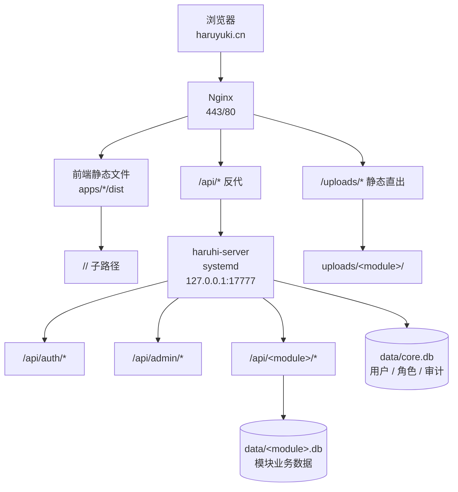

# haruhifanclub-website

凉宫春日应援团站点统一仓库。前端应用、Rust 后端、数据库 schema、部署脚本和项目文档都在这里维护，适合从一个入口了解、开发和部署整套站点。

## 项目简介

这个仓库维护 `haruyuki.cn` 上的应援团站群代码。它把站点前台、后台管理、共享前端能力、后端服务、数据库结构和部署配置收在同一个 monorepo 中，减少跨仓库查找和同步成本。

工程上采用单仓库组织：前端应用各自构建、各自挂在子路径下；后端由一个 axum 进程提供 `/api/<module>/*`、登录鉴权、RBAC、上传目录和 schema 更新。业务数据按模块拆到不同 SQLite 库，用户和角色集中在 `core.db`。

第一次接触项目时，建议先按“快速上手”启动后端和任一前端应用；要理解模块如何接入，看 [docs/ARCHITECTURE.md](docs/ARCHITECTURE.md) 和 [docs/ADDING_MODULE.md](docs/ADDING_MODULE.md)。

## 快速上手

依赖：

- Node `>=20`，建议 `nvm use`
- pnpm `10.11.0`
- Rust `1.87.0`，由 `rust-toolchain.toml` 锁定
- `ffmpeg`，用于音频转码
- `sqlite3`，用于查库和备份

```bash
nvm use
corepack enable
corepack prepare pnpm@10.11.0 --activate

pnpm install
cargo build

# 生成本地 .env。该文件会把后端端口设为 127.0.0.1:17777。
bash deploy/gen-secrets.sh
# 或手动复制模板：
# cp deploy/env.sample .env

# 起后端
pnpm dev:backend

# 另开一个终端起前端
pnpm dev:news
pnpm dev:art
pnpm dev:exam
pnpm dev:novel
pnpm dev:shop
pnpm dev:console
pnpm dev:design-system
```

本地前端 dev server 都把 `/api` 和 `/uploads` 代理到 `127.0.0.1:17777`。请先准备 `.env`；否则 `Config` 的代码默认值是 `127.0.0.1:8080`，前端代理会找不到后端。

也可以一条命令同时起后端和一个前端：

```bash
APP=novel pnpm dev    # 默认 APP=news
```

## 前端 app

| app           | 包名                         | 子路径            | dev 端口 | 说明                                             |
| ------------- | ---------------------------- | ----------------- | -------- | ------------------------------------------------ |
| news          | `@haruhi/news`               | `/news/`          | 5204     | 团内新闻（春日团报）、活动、积分和后台管理       |
| art           | `@haruhi/art`                | `/art/`           | 5201     | 画廊、投稿、匿名互动、积分和审核后台             |
| exam          | `@haruhi/exam`               | `/exam/`          | 5202     | 在线试卷、编辑器、分享导出和审核后台，TypeScript |
| novel         | `@haruhi/novel`              | `/library/`       | 5203     | EPUB 书架、阅读器、上传和编目后台                |
| fiction       | `@haruhi/fiction`            | `/fiction/`       | 5207     | 同人小说创作与阅读、富文本编辑器、书库和创作中心 |
| shop          | `@haruhi/shop`               | `/shop/`          | 5205     | 商品、订单、预售、优惠券、物流和商城后台         |
| console       | `@haruhi/console`            | `/console/`       | 5200     | 超管控制台，管理用户和 RBAC 角色，TypeScript     |
| design-system | `@haruhi/design-system-docs` | `/design-system/` | 5206     | SOS / Parallel Design System 静态规范页          |

每个 app 都有自己的 `README.md`。入口命令统一为：

```bash
pnpm --filter @haruhi/<app> dev
pnpm --filter @haruhi/<app> build
```

`exam` 和 `console` 的 build 会先运行 `vue-tsc --noEmit`。

## 后端 crate

| crate    | 包名            | 说明                                                            |
| -------- | --------------- | --------------------------------------------------------------- |
| `server` | `haruhi-server` | axum 二进制，装配路由、CORS、上传静态目录、登录限流和关停刷 WAL |
| `core`   | `haruhi-core`   | 环境配置、错误响应、文本/数值解析工具                           |
| `db`     | `haruhi-db`     | SQLite 连接池、WAL 配置、schema 更新                            |
| `auth`   | `haruhi-auth`   | JWT、argon2 密码、RBAC 授权和 axum 提取器                       |
| `media`  | `haruhi-media`  | 上传落盘、图片 WebP、EPUB 元数据、音频转 MP3                    |
| `ai`     | `haruhi-ai`     | DashScope/OpenAI 兼容内容审核；未配置 key 时放行                |
| `mail`   | `haruhi-mail`   | SMTP/Resend 单封邮件发送；队列在 shop 模块                      |

后端查询使用 `sqlx::query` / `query_as` 的运行时校验，不使用 `query!` 宏，因此构建不需要 `DATABASE_URL`。

## 生产部署拓扑



关键点：

- Nginx 托管各 app 的构建产物，并为 SPA 子路径做 history 回退。
- `/api/` 反代到单个 `haruhi-server` 进程。
- `/uploads/` 由 Nginx 直接读磁盘，绕过后端。
- `core.db` 存用户、角色和审计，各业务模块使用独立 SQLite。

## 目录结构

```text
apps/                  前端应用目录
packages/api-client/   已启用的共享前端包：fetch、JWT、RBAC、上传 URL
packages/design-system/ CSS-first 设计系统：tokens、components、bridges
packages/ui/           预留目录，当前无 package.json
packages/config/       预留目录，当前无 package.json
backend/crates/        Rust workspace crate
backend/migrations/    core 与各模块 schema SQL
deploy/                Nginx、systemd、部署、备份脚本
docs/                  架构、部署、新增模块、协作说明
data/                  运行时 SQLite，本地生成，不提交
uploads/               运行时上传文件，本地生成，不提交
```

## 常用命令

```bash
pnpm lint                         # eslint + cargo fmt --check + cargo clippy
pnpm lint:js                      # 只跑前端 ESLint
pnpm format                       # prettier + cargo fmt
cargo test --workspace            # 后端测试（含 server 模块级集成回归网）
pnpm -r --if-present test         # 前端单测（vitest，如 news / api-client）
pnpm build:apps                   # 构建 apps/*/dist
cargo build --release -p haruhi-server
```

生产部署不要直接拿本机 release 二进制上传到 Linux 服务器。使用脚本交叉编译并推送：

```bash
HARUHI_DEPLOY_HOST=root@<server> bash deploy/deploy.sh
```

部署细节见 [docs/DEPLOYMENT.md](docs/DEPLOYMENT.md)。

## 协作约定

- 文档、注释、提交信息使用中文。
- PR 标题使用 Conventional Commits：`type(scope): subject`。
- 合并采用 squash，PR 标题就是最终提交信息。
- CI 的 required status check 只配置聚合 job `ci-ok`。
- 新模块接入步骤见 [docs/ADDING_MODULE.md](docs/ADDING_MODULE.md)。

## 文档入口

- [CONTRIBUTING.md](CONTRIBUTING.md)：协作流程、PR、提交规范、评审和 CI 门禁
- [docs/ARCHITECTURE.md](docs/ARCHITECTURE.md)：后端、前端、数据库和 RBAC 设计
- [docs/DEPLOYMENT.md](docs/DEPLOYMENT.md)：部署、环境变量、备份
- [docs/ADDING_MODULE.md](docs/ADDING_MODULE.md)：新增业务模块
- [docs/DESIGN_SYSTEM.md](docs/DESIGN_SYSTEM.md)：SOS / Parallel Design System 项目设计规范
- [docs/COLLABORATION.md](docs/COLLABORATION.md)：推到 GitHub 后启用分支保护、CodeRabbit、Dependabot
- [SECURITY.md](SECURITY.md)：安全披露流程
